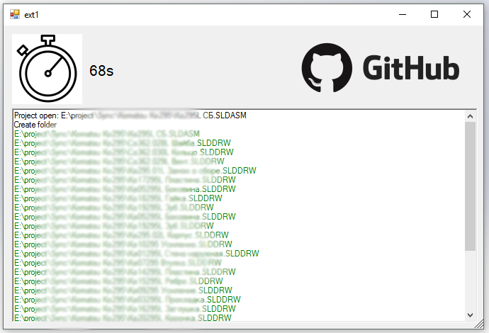

# Сollect to pdf
## Introduction

This macro saves all drawings to "pdf" on an assembly part opened in solidworks.

## Start
Download this project or prepare a build [here](/bin)

Upon completion, a window with information about the process will appear.

## End
Upon completion, a window with information about the process will appear.

To make it easier to read, the text of the message will be colored in different colors:
- **Green** all converted documents
- **Red** tetanies with no blueprints found
- **Blue** for other useful information.

